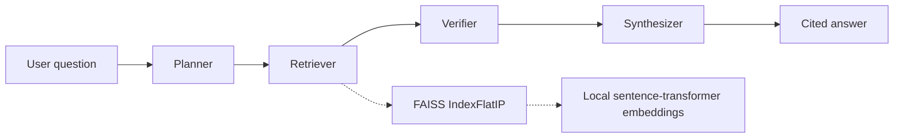

# System Design

## System Architecture

Kestrel is a local RAG pipeline built around a LangGraph shared-state workflow:

The corpus loader reads root-level JSONL, validates required fields, preserves chunk IDs, and verifies the expected SHA-256 before loading. The corpus currently contains 154 chunks across 25 documents.

## Agent Responsibilities

### Planner

The Planner classifies the question, detects whether it is a follow-up, combines recent conversation history with a follow-up question when needed, and identifies likely multi-hop questions.

### Retriever

The Retriever loads the corpus into the existing `FAISSStore`, embeds chunk text locally, and retrieves the top five results. Each result retains the chunk ID, title, text, publication date, version, and similarity score. FAISS uses normalized embeddings with `IndexFlatIP`; the store also applies title-aware indexing, candidate expansion, and general lexical/entity reranking.

### Verifier

The Verifier examines retrieved evidence and assigns one of four verdicts:

- `supported`: evidence consistently supports the material claim.
- `partially_supported`: only part of the material claim is established.
- `conflicting_evidence`: different sources explicitly make incompatible claims about the same proposition.
- `insufficient_evidence`: the retrieved evidence does not establish the claim.

Sequential chunks from one document are treated as complementary. Conflict details retain chunk IDs, claims, publication date, version, and a recency note.

### Synthesizer

The Synthesizer uses only the verifier assessment and retrieved evidence. It produces a concise direct answer, avoids reproducing complete chunks, cites factual claims as `[chunk_id — title]`, reports insufficient evidence explicitly, and presents both claims when evidence conflicts.

## Shared State and Handoffs

LangGraph passes a typed `AgentState` between nodes. The state can contain the original question, conversation history, rewritten query, question classification, retrieved chunks, claim assessments, and final answer.

The graph is compiled with this fixed sequence:

`START -> planner -> retriever -> verifier -> synthesizer -> END`

The Retriever receives the Planner's `query`. The Verifier receives ranked retrieved chunks. The Synthesizer receives the verifier verdict and evidence details.

## Retrieval Flow

1. Load and validate the corpus.
2. Embed `title + text` locally with `sentence-transformers/all-MiniLM-L6-v2`.
3. Add normalized vectors to FAISS `IndexFlatIP`.
4. Retrieve an expanded candidate set.
5. Rerank candidates using non-stopword overlap, title matches, and capitalized entity matches.
6. Return the top five chunks with metadata.

The measured improvement documented in `results/improvement.md` recovered `pricing-plans:0` for the Starter retention question: expected-chunk recall and citation recall changed from 0.0 to 1.0 for that question.

## Evaluation Architecture

`results/eval_questions.jsonl` contains 18 questions across single-hop, multi-hop, conflicting, unsupported, and follow-up categories. `evaluation/run_eval.py` processes standalone questions and groups follow-up turns by conversation ID. It passes prior conversation messages into the workflow, measures latency with `time.perf_counter()`, and writes `results/eval_results.jsonl`.

The recorded aggregate metrics are in `results/metrics_summary.json`. They include retrieval quality, faithfulness, relevance, end-to-end correctness, citation precision, and citation recall. Token usage was not logged.

## LangSmith Tracing

LangSmith configuration is read from environment variables loaded from `.env`: `LANGSMITH_TRACING`, `LANGSMITH_API_KEY`, and `LANGSMITH_PROJECT`. The project name used by the repository is `kestrel-multi-agent`.

Each graph node is wrapped as a named traceable operation, so Planner, Retriever, Verifier, and Synthesizer inputs and outputs appear in the complete workflow trace. Evaluation runs create a root workflow trace and record a returned run URL when the SDK provides one.
